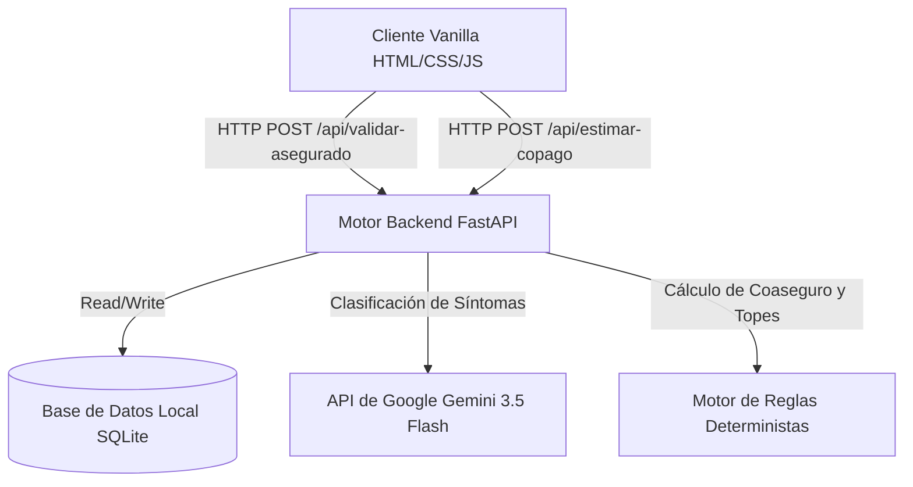
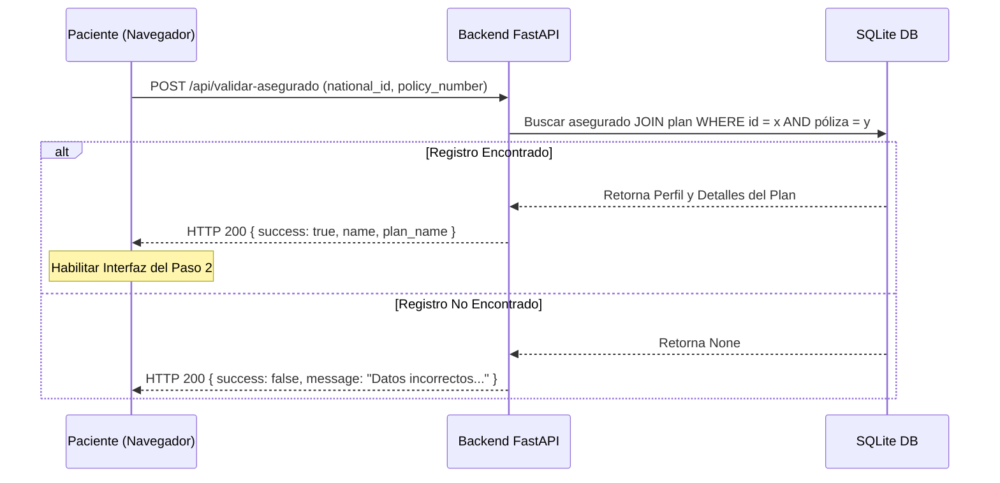
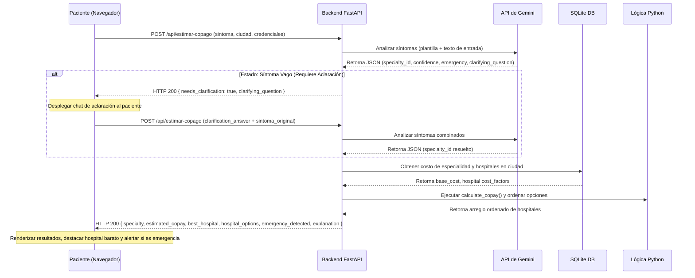

# Arquitectura del Sistema

Este documento describe la arquitectura de software, los límites de ejecución y los flujos de datos del Asistente de Copagos de Seguros de Salud ("Estimador Agéntico de Copago y Cobertura para el Paciente").

---

## 1. Componentes Arquitectónicos

La aplicación está estructurada como una arquitectura cliente-servidor desacoplada con un motor de base de datos local y orquestación de LLM externos.



### Cliente (Frontend)
- **Tecnología**: HTML5 vanilla, CSS3 (con variables CSS clínicas y diseño glassmorphic) y JavaScript ES6+.
- **Rol**: Recopila las entradas del usuario, administra el estado de verificación local, orquesta la interfaz conversacional de aclaración, presenta el listado ordenado de resultados y persiste el historial mediante `localStorage`.

### Servicio Backend (Servidor)
- **Tecnología**: Python 3.12, FastAPI y Uvicorn.
- **Rol**: Expone los endpoints de la API REST, inicializa las tablas de la base de datos, valida y sanitiza las entradas, interactúa con la API del LLM, evalúa las reglas de negocio y clasifica los proveedores.

### Base de Datos Local (Almacenamiento)
- **Tecnología**: SQLite3.
- **Rol**: Almacena perfiles de asegurados, pólizas, costos base de especialidades médicas y metadatos de los hospitales de la red.

### Orquestador LLM (Externo)
- **Tecnología**: Google Gemini 3.5 Flash (a través del SDK `google-genai`), con motores de fallback basados en OpenAI y reglas léxicas locales.
- **Rol**: Clasifica los síntomas escritos por el usuario en identificadores válidos de especialidad, explica el criterio en español, detecta emergencias de riesgo vital y genera preguntas de aclaración.

---

## 2. Límites de Ejecución: IA vs. Código

Para garantizar la precisión matemática, la predictibilidad financiera y el cumplimiento normativo de los seguros, se establece un límite estricto de ejecución:

```
[Entrada de Usuario: Síntomas]
               │
               ▼
┌──────────────────────────────┐
│  Motor de IA (Gemini LLM)    │
│  - Inferir Especialidad      │
│  - Detectar Emergencias      │
│  - Redactar Criterio Médico  │
└──────────────┬───────────────┘
               │ (Retorna ID de Especialidad, ej. 'cardiologia')
               ▼
┌──────────────────────────────┐
│  Código Determinista (Python)│
│  - Buscar Tarifas del Plan   │
│  - Calcular Fórmulas Copago  │
│  - Aplicar Topes y Mínimos   │
│  - Ordenar Red de Hospitales │
└──────────────────────────────┘
```

- **Delegado a la IA**: Procesamiento de lenguaje natural, interpretación clínica y generación de respuestas empáticas.
- **Enfocado en Código**: Cálculos matemáticos, comparaciones de límites (cap/floor) y clasificación jerárquica de arreglos de datos. Esto previene cualquier error de cálculo numérico o alucinación del LLM.

---

## 3. Diagramas de Flujo de Datos

### Proceso de Validación (Paso 1)


### Proceso de Estimación y Aclaración (Paso 2)


---

## 4. Gestión del Estado del Loop de Aclaración

El backend de FastAPI está diseñado para ser completamente stateless (sin estado) para facilitar su escalabilidad horizontal.
1. Cuando la API retorna `needs_clarification: true` junto con una `clarifying_question`, el frontend congela las entradas principales.
2. El cliente almacena el síntoma original en la variable de JavaScript `previousSymptomContext`.
3. El frontend despliega un chat interactivo con la pregunta del sistema.
4. Al responder, el cliente envía una nueva petición POST a `/api/estimar-copago`, enviando el texto actual en `clarification_answer`, el síntoma inicial en `previous_symptom` y el valor original en `symptom`.
5. El backend concatena ambos inputs, los somete a una clasificación final en el LLM y continúa con los cálculos de negocio tradicionales.
